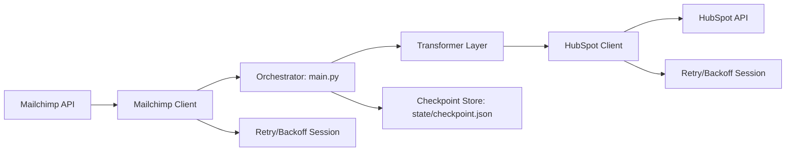

# Mailchimp → HubSpot Reliability-Engineered Migration Platform

## Executive Summary

This repository implements a **resumable CRM migration framework** for moving contact data from Mailchimp to HubSpot with operational safety controls.  
The pipeline is designed for **correctness, deterministic recovery, and migration reliability** under real API failure conditions, not maximum theoretical throughput.

| Dimension | Design Position |
|---|---|
| Primary objective | Safe, repeatable migration execution |
| Execution model | Synchronous, checkpointed batch orchestration |
| Reliability model | Retry/backoff + persistent offset state + idempotent upsert |
| Recovery model | Restart from last committed offset |

## Business Problem

Cross-platform CRM migrations are operationally risky: API rate limits, transient failures, and long-running jobs create restart and duplication risk.  
This platform addresses those failure modes with controlled pagination, batch upsert semantics, and persistent checkpointing.

## Why This System Exists

- Eliminate manual export/import dependency for large contact migrations.
- Preserve core contact attributes during platform cutover.
- Support deterministic restart after interruption without full reprocessing.
- Provide an operational migration backbone that can be reused across engagements.

## Key Engineering Highlights

- Isolated source and sink clients (`clients/`) with retry-enabled HTTP sessions.
- Explicit transformation boundary (`transformers/`) for schema mapping control.
- Offset checkpoint persistence (`state/checkpoint.json`) for resumability.
- Batch upsert into HubSpot using identity property semantics.
- API-aware retry strategy for 429 and 5xx transient failures.
- Centralized operational logging for run visibility.

## Architecture Overview



## Migration Workflow

1. Load runtime settings and last checkpoint offset.
2. Fetch Mailchimp members page by page using bounded offset pagination.
3. Transform each source record into HubSpot property payloads.
4. Batch upsert transformed records to HubSpot by `email`.
5. Persist next offset checkpoint after each successful batch.
6. Continue until no further records are available.

## System Design Decisions

| Decision | Rationale |
|---|---|
| Offset checkpointing | Enables deterministic restart boundaries for long-running jobs |
| Batch upsert | Reduces API write overhead and supports idempotent update/create behavior |
| Client isolation | Keeps API transport concerns decoupled from orchestration logic |
| Synchronous control loop | Prioritizes predictability and operational simplicity |
| File-based state | Lightweight persistence for single-runner reliability |

## Reliability Engineering

- HTTP sessions use retry adapters for transient API failures.
- Retry status classes include **429, 500, 502, 503, 504**.
- Timeouts are explicitly set for outbound API calls.
- Partial HubSpot batch failures are surfaced through logged warnings.
- Invalid records missing required identity fields are skipped safely.

## Checkpoint Recovery

- Checkpoint file stores the next offset to process.
- On restart, migration resumes from persisted offset.
- Checkpoint commit occurs after each processed batch.
- Restarting avoids full replay and limits duplicate processing risk.

## Retry & Backoff Strategy

| Client | Retry profile |
|---|---|
| Mailchimp client | Retry-enabled GET session; transient failure recovery |
| HubSpot client | Retry-enabled POST/PATCH session; transient sink recovery |

Backoff is configured to absorb temporary platform-side instability and rate-pressure events.

## Batch Processing Strategy

- Source extraction uses offset + limit pagination.
- Sink writes use HubSpot batch endpoint for grouped upserts.
- Batch-oriented flow balances API safety and migration progress.

## Idempotent Upsert Logic

- HubSpot writes are keyed by an identity property (`email`).
- Existing contacts are updated; missing contacts are created.
- Replayed batches remain operationally safe under restart scenarios.

## Scalability Considerations

- Current design scales linearly for single-runner workloads.
- Memory remains bounded by batch/page size, not total dataset size.
- Future scale path: partitioned workers + distributed checkpoint metadata.

## Tradeoffs & Constraints

- Synchronous execution limits peak throughput.
- File checkpointing is not multi-worker safe.
- Offset-level recovery can replay part of a boundary batch in edge scenarios.
- Design intentionally favors reliability and operational clarity over concurrency.

## Performance Optimization

- Persistent HTTP session reuse reduces connection overhead.
- Batch upsert reduces sink API call amplification.
- Tunable page limit allows environment-specific latency/throughput balancing.

## Security Considerations

- API credentials are loaded from environment variables.
- Secrets are excluded from version control via `.gitignore`.
- No hardcoded tokens in source.
- Runtime state files are environment-scoped.

## Project Structure

```text
mailchimp_to_hubspot__migration/
├── main.py
├── clients/
│   ├── mailchimp_client.py
│   └── hubspot_client.py
├── transformers/
│   └── contact_mapping.py
├── state/
│   ├── checkpoint.py
│   └── checkpoint.json
├── config/
│   ├── settings.py
│   ├── mailchimp_columns.py
│   └── hubspot_columns.py
├── utils/
│   └── logger.py
├── tests/
└── docs/
```

## Installation

```bash
pip install -r requirements.txt
```

## Environment Setup

Create `.env`:

```env
HUBSPOT_ACCESS_TOKEN=your_hubspot_private_app_token
Mailchimp_API_TOKEN=your_mailchimp_api_key
Mailchimp_Audience_ID=your_mailchimp_audience_id
Mailchimp_PAGE_LIMIT=100
```

## Usage Instructions

```bash
python main.py
```

## Example Migration Flow

```text
Starting migration from offset: 0
Processed batch of 100. Next offset: 100
Processed batch of 100. Next offset: 200
...
===== MIGRATION SUMMARY =====
Total processed: <n>
Total time: <seconds>
Records per second: <value>
Migration completed successfully.
```

## Logging & Recovery

- Runtime output includes batch progression and summary metrics.
- Failed runs can be restarted without manual offset recalculation.
- Clear checkpoint state allows deterministic operational recovery.

## Future Evolution Roadmap

1. Orchestrator integration (Airflow/Prefect) for scheduled managed runs.
2. Distributed checkpoint metadata store for multi-worker execution.
3. Async/queue-backed worker model with DLQ for non-retriable records.
4. Structured observability (metrics, tracing, alerting) for SLO governance.
5. Schema-contract validation and migration reconciliation reporting.

## Documentation Links

- [Architecture](docs/architecture.md)
- [Checkpoint Recovery](docs/checkpoint-recovery.md)
- [Reliability Engineering](docs/reliability-engineering.md)
- [Engineering Decisions](docs/engineering-decisions.md)
- [Scalability](docs/scalability.md)
- [Engineering Case Study](docs/case-study.md)
- [Diagrams](diagrams/)

