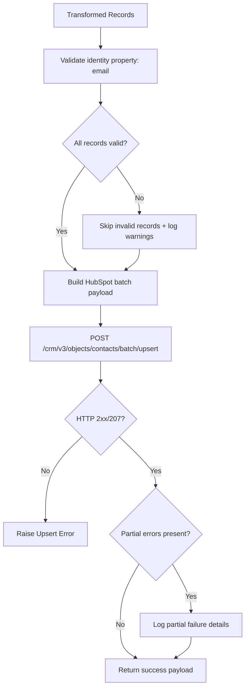

# Batch Upsert Flow Diagram

```mermaid
flowchart TD
    A[Transformed Records] --> B[Validate identity property: email]
    B --> C{All records valid?}
    C -- No --> D[Skip invalid records + log warnings]
    C -- Yes --> E[Build HubSpot batch payload]
    D --> E
    E --> F[POST /crm/v3/objects/contacts/batch/upsert]
    F --> G{HTTP 2xx/207?}
    G -- No --> H[Raise Upsert Error]
    G -- Yes --> I{Partial errors present?}
    I -- Yes --> J[Log partial failure details]
    I -- No --> K[Return success payload]
    J --> K
```

