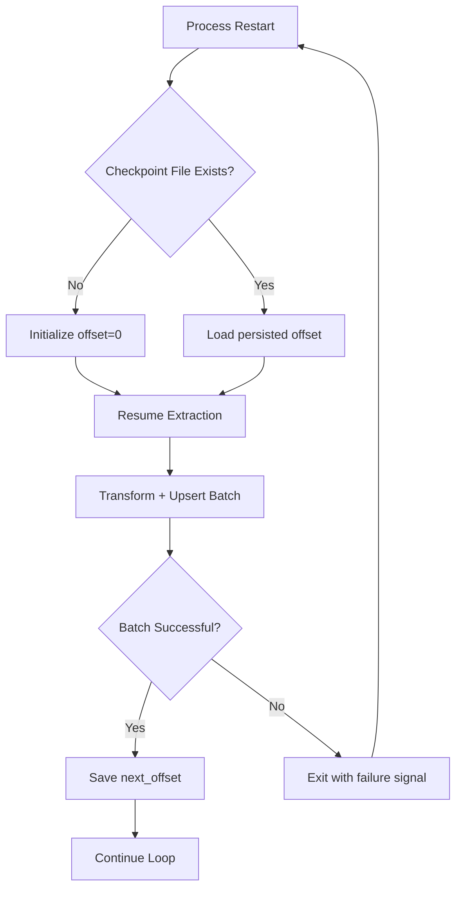

# Checkpoint Recovery Flow Diagram

```mermaid
flowchart TD
    A[Process Restart] --> B{Checkpoint File Exists?}
    B -- No --> C[Initialize offset=0]
    B -- Yes --> D[Load persisted offset]
    C --> E[Resume Extraction]
    D --> E
    E --> F[Transform + Upsert Batch]
    F --> G{Batch Successful?}
    G -- Yes --> H[Save next_offset]
    H --> I[Continue Loop]
    G -- No --> J[Exit with failure signal]
    J --> A
```

