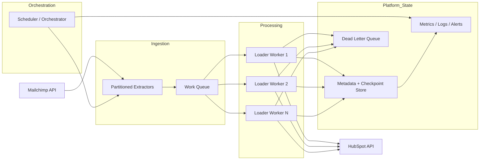

# Future Scalable Architecture Diagram

```mermaid
flowchart LR
    subgraph Orchestration
        ORCH[Scheduler / Orchestrator]
    end

    subgraph Ingestion
        EXT[Partitioned Extractors]
        Q[Work Queue]
    end

    subgraph Processing
        W1[Loader Worker 1]
        W2[Loader Worker 2]
        WN[Loader Worker N]
    end

    subgraph Platform_State
        META[Metadata + Checkpoint Store]
        DLQ[Dead Letter Queue]
        OBS[Metrics / Logs / Alerts]
    end

    MC[Mailchimp API] --> EXT
    EXT --> Q
    ORCH --> EXT
    Q --> W1
    Q --> W2
    Q --> WN
    W1 --> HS[HubSpot API]
    W2 --> HS
    WN --> HS
    W1 --> META
    W2 --> META
    WN --> META
    W1 --> DLQ
    W2 --> DLQ
    WN --> DLQ
    ORCH --> OBS
    META --> OBS
```

