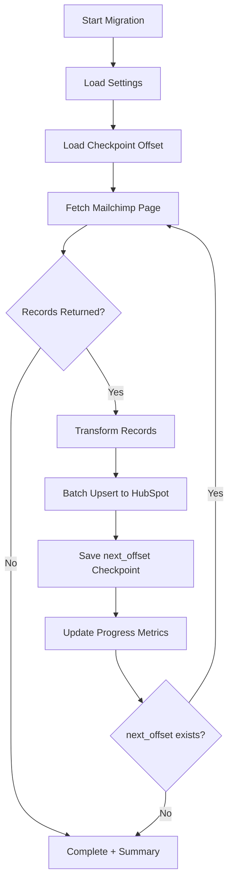

# Migration Workflow Diagram

```mermaid
flowchart TD
    A[Start Migration] --> B[Load Settings]
    B --> C[Load Checkpoint Offset]
    C --> D[Fetch Mailchimp Page]
    D --> E{Records Returned?}
    E -- No --> Z[Complete + Summary]
    E -- Yes --> F[Transform Records]
    F --> G[Batch Upsert to HubSpot]
    G --> H[Save next_offset Checkpoint]
    H --> I[Update Progress Metrics]
    I --> J{next_offset exists?}
    J -- Yes --> D
    J -- No --> Z
```

