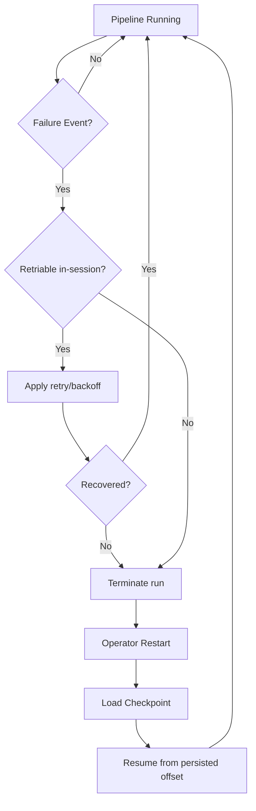

# Operational Recovery Flow Diagram

```mermaid
flowchart TD
    A[Pipeline Running] --> B{Failure Event?}
    B -- No --> A
    B -- Yes --> C{Retriable in-session?}
    C -- Yes --> D[Apply retry/backoff]
    D --> E{Recovered?}
    E -- Yes --> A
    E -- No --> F[Terminate run]
    C -- No --> F
    F --> G[Operator Restart]
    G --> H[Load Checkpoint]
    H --> I[Resume from persisted offset]
    I --> A
```

