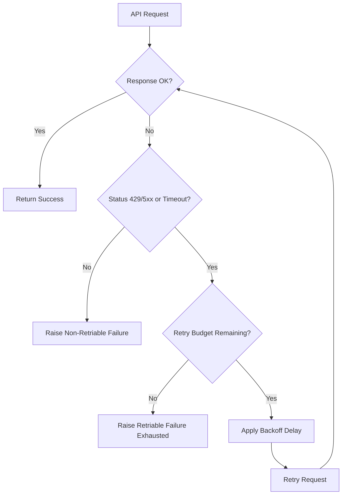

# Retry Lifecycle Diagram

```mermaid
flowchart TD
    A[API Request] --> B{Response OK?}
    B -- Yes --> C[Return Success]
    B -- No --> D{Status 429/5xx or Timeout?}
    D -- No --> E[Raise Non-Retriable Failure]
    D -- Yes --> F{Retry Budget Remaining?}
    F -- No --> G[Raise Retriable Failure Exhausted]
    F -- Yes --> H[Apply Backoff Delay]
    H --> I[Retry Request]
    I --> B
```

