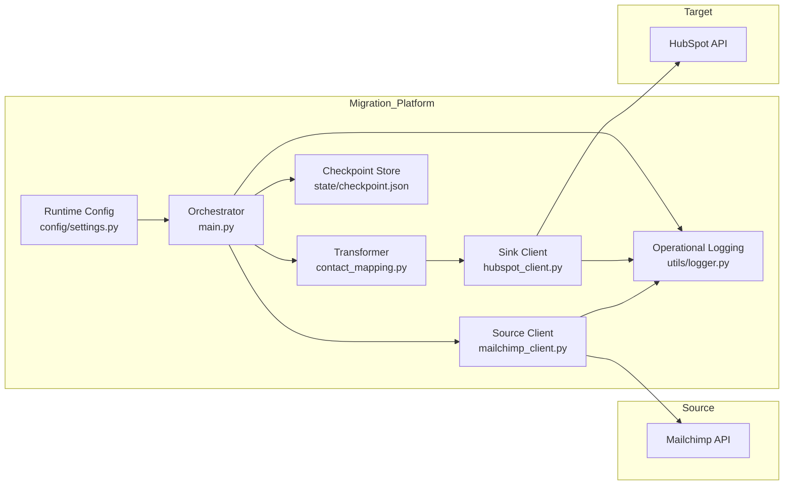

# System Architecture Diagram

```mermaid
flowchart LR
    subgraph Source
        MC[Mailchimp API]
    end

    subgraph Migration_Platform
        MAIN[Orchestrator<br/>main.py]
        SRC[Source Client<br/>mailchimp_client.py]
        TR[Transformer<br/>contact_mapping.py]
        SINK[Sink Client<br/>hubspot_client.py]
        CP[Checkpoint Store<br/>state/checkpoint.json]
        CFG[Runtime Config<br/>config/settings.py]
        LOG[Operational Logging<br/>utils/logger.py]
    end

    subgraph Target
        HS[HubSpot API]
    end

    CFG --> MAIN
    MAIN --> SRC
    SRC --> MC
    MAIN --> TR
    TR --> SINK
    SINK --> HS
    MAIN --> CP
    SRC --> LOG
    SINK --> LOG
    MAIN --> LOG
```

