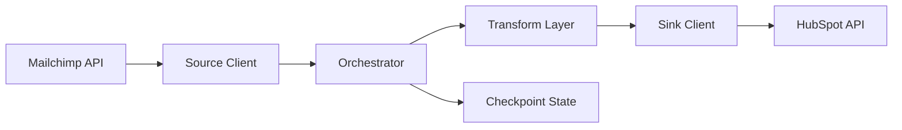
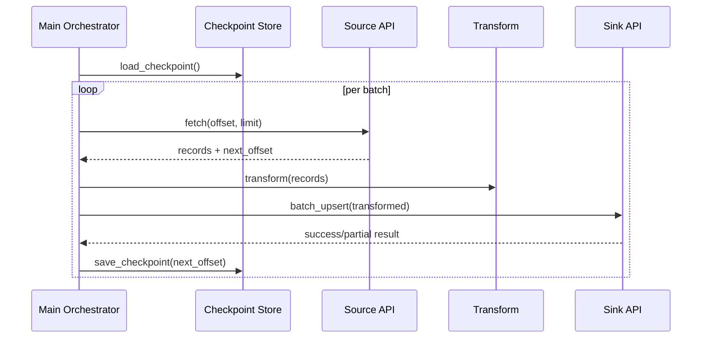

# Architecture Documentation

## System Overview

This platform is a **reliability-first migration system** that moves contact data from Mailchimp (source) to HubSpot (sink) through a checkpointed orchestration loop.  
The architecture is intentionally optimized for **operational recovery and deterministic progress**, not parallel throughput.

## Component Responsibilities

| Component | Responsibility |
|---|---|
| `main.py` | Orchestration control flow, batch lifecycle, checkpoint commit points |
| `clients/mailchimp_client.py` | Source extraction, API request construction, source retry behavior |
| `clients/hubspot_client.py` | Sink batch upsert, sink retry behavior, partial failure surfacing |
| `transformers/contact_mapping.py` | Source-to-target schema transformation and field normalization |
| `state/checkpoint.py` | Persistent offset state load/save lifecycle |
| `config/settings.py` | Runtime configuration and environment variable loading |
| `utils/logger.py` | Shared operational logging setup |

## Source/Sink Architecture

- **Source path**: offset-based extraction from Mailchimp members endpoint.
- **Sink path**: HubSpot batch upsert endpoint with identity property (`email`).
- **State path**: checkpoint commit after each successful processed batch.

## Orchestration Flow

1. Load settings and current checkpoint offset.
2. Fetch source page for `(offset, limit)`.
3. Transform source records to HubSpot payload contract.
4. Submit batch upsert request.
5. Save `next_offset` checkpoint.
6. Repeat until source exhaustion.

## Transform Layer

The transform layer isolates schema translation from transport logic:

- Maps Mailchimp contact fields to HubSpot properties.
- Normalizes optional nested fields (e.g., address and tags).
- Enforces migration payload consistency before sink submission.

This boundary allows schema evolution without modifying source/sink communication code.

## State Management

State is persisted as a simple JSON checkpoint file:

- `load_checkpoint()` returns last committed offset.
- `save_checkpoint(offset)` persists next processing boundary.

State is intentionally minimal to reduce operational coupling and simplify restart semantics.

## Checkpoint Lifecycle

## API Communication Lifecycle

- Both clients use persistent `requests.Session` with retry adapters.
- Requests use explicit timeout boundaries.
- Retry policy handles transient classes (429 and 5xx).
- Sink client logs partial batch failures to preserve operational visibility.

## Dependency Boundaries

| Boundary | Rule |
|---|---|
| Orchestration ↔ Clients | Orchestrator does not embed endpoint-specific request logic |
| Clients ↔ Transform | Clients do not perform schema mapping |
| Transform ↔ State | Transform layer remains stateless; no checkpoint mutation |
| Config ↔ Runtime | Runtime behavior controlled through environment configuration |

These boundaries keep failure diagnosis and change propagation localized.

## Reliability Model

The reliability model combines:

1. **Transient fault tolerance** via retry/backoff envelopes.
2. **Progress durability** via persistent checkpoints.
3. **Write safety** via idempotent upsert semantics.
4. **Operational observability** via structured runtime logs.

## Control Flow Explanation

This architecture was designed to make migration progress **deterministic under interruption**:

- If API calls fail transiently, retries absorb the disturbance.
- If the process terminates, restart resumes at the last committed offset.
- If sink data already exists, upsert updates instead of duplicating.

## Why This Architecture

- Migration cutovers are failure-prone and often long-running.
- External APIs are operationally volatile under load and rate limits.
- Deterministic restart is more valuable than peak one-run throughput.

## Tradeoffs

| Tradeoff | Result |
|---|---|
| Synchronous orchestration | High predictability, lower concurrency ceiling |
| File-based checkpointing | Operational simplicity, no distributed coordination |
| Offset checkpoint granularity | Lightweight state, coarser replay control |

## Operational Recovery Support

Operational recovery is enabled by design:

- Restart path does not require manual recomputation.
- Progress boundaries are explicit and durable.
- API instability is treated as expected and recoverable.

