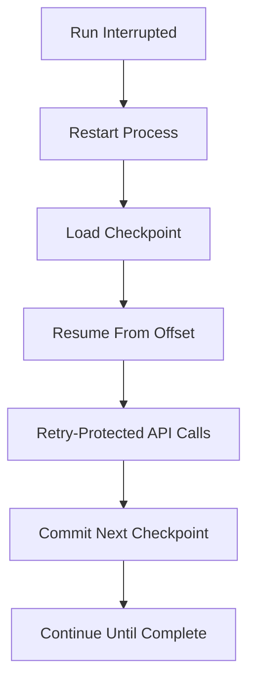

# Engineering Case Study: Reliability-First Mailchimp → HubSpot Migration Platform

## Executive Summary

A migration platform was implemented to execute CRM cutover from Mailchimp to HubSpot with deterministic restart and operational resilience.  
The system design centered on checkpointed progression, API fault tolerance, and idempotent sink behavior to minimize migration risk.

## Business Problem

The organization needed to decommission Mailchimp while preserving contact integrity in HubSpot.  
Manual migration approaches were operationally fragile, difficult to recover, and high-risk under large data volumes.

## Engineering Challenges

- External API rate limits and transient availability failures.
- Long-running migration windows with interruption exposure.
- Source and sink schema mismatches.
- Need for repeatable execution without duplicate-creation risk.

## Migration Risks

| Risk | Operational Impact |
|---|---|
| Mid-run interruption | Full rerun risk without checkpointing |
| Rate-limited API windows | Throughput collapse and unstable completion |
| Partial batch outcomes | Hidden data loss if not surfaced |
| Schema mismatch | Field loss or malformed sink payloads |
| Duplicate writes on replay | Data quality degradation in target CRM |

## Architecture Decisions

- Isolated source/sink clients for transport-level concerns.
- Dedicated transformation layer for contract normalization.
- Checkpoint file for offset durability and deterministic restart.
- Batch upsert sink writes to balance reliability and call efficiency.

These decisions reduced coupling and improved operational control.

## Reliability Engineering

Reliability controls were implemented as first-class behaviors:

- retry/backoff envelopes for 429 and 5xx classes,
- explicit timeout boundaries,
- session reuse for stable long-run transport behavior,
- partial batch error visibility in sink operations.

## State Management

Progress is represented by persisted offset state:

- checkpoint commit after successful batch completion,
- restart from committed boundary,
- bounded replay scope under failure.

This model converts catastrophic reruns into controlled recovery steps.

## API Integration Strategy

Source strategy:

- offset-based paginated extraction,
- bounded page size for API safety.

Sink strategy:

- batch upsert keyed by `email`,
- identity-based update/create semantics for replay safety.

## Failure Recovery Design

Recovery behavior is deterministic, operator-light, and resilient to transient platform instability.

## Scalability Considerations

- Current execution is single-runner and synchronous by design.
- Memory usage remains batch-bounded.
- Throughput scales primarily with API health and configured page size.
- Architecture provides clear extension path to partitioned workers and queue orchestration.

## Technical Tradeoffs

| Choice | Benefit | Cost |
|---|---|---|
| Synchronous loop | Predictable recovery and debugging | Lower max throughput |
| File checkpoint | Simple and low dependency | Not distributed-safe |
| Offset-based cursor | Deterministic progress | Coarser replay granularity |
| Retry-heavy safety | Better completion reliability | Increased latency under degradation |

## Operational Outcomes

- Migration flow became restartable without manual offset tracking.
- Transient API failures were absorbed without full job collapse.
- Replay safety improved through idempotent upsert identity semantics.
- Operational control shifted from ad hoc interventions to deterministic process behavior.

## Future Evolution

1. Distributed checkpoint and metadata store.
2. Queue-backed async worker architecture.
3. DLQ for persistent non-retriable records.
4. Structured observability and SLO-driven run governance.
5. Post-migration reconciliation reporting and schema validation gates.

## Key Engineering Learnings

1. Reliability primitives (retry + checkpoint + idempotency) are the foundation of safe migration systems.
2. Deterministic recovery boundaries reduce both operational stress and business risk.
3. Throughput optimization is secondary until correctness and replay safety are guaranteed.
4. Modular boundaries accelerate evolution from project implementation to reusable migration platform.

