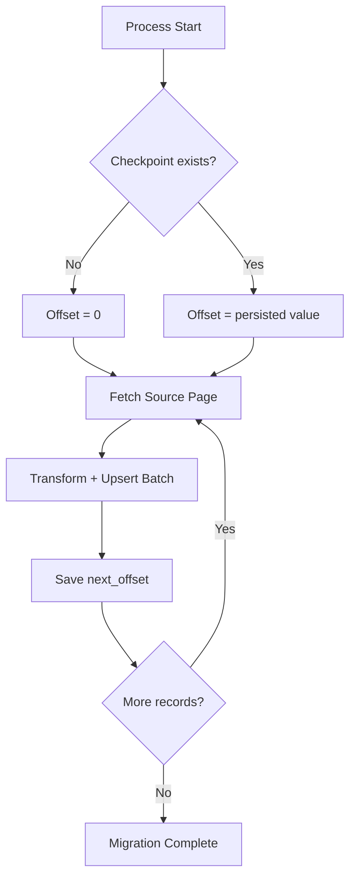

# Checkpoint and Recovery Model

## Purpose

Checkpointing provides deterministic restart boundaries for long-running migration workloads where interruption is expected (rate limits, network instability, deployment restarts, operator stops).

## Offset Checkpointing

The system persists a single migration cursor:

- **Checkpoint key**: `offset`
- **Storage**: `state/checkpoint.json`
- **Commit cadence**: after each successfully processed batch

This creates a lightweight and explicit progress contract for restartability.

## Restart Semantics

On startup:

1. Load checkpoint from `state/checkpoint.json`.
2. If absent, start at `offset = 0`.
3. Resume extraction from the persisted boundary.

No manual offset computation is required during recovery.

## Deterministic Replay Boundaries

A checkpoint represents the **next source page boundary**.  
This means replay behavior is deterministic at the page level:

- Successful batch commit advances offset.
- Uncommitted in-flight work is eligible for replay on restart.

## Resume Workflow

## Interruption Handling

Interruption scenarios handled by checkpoint design:

| Interruption Type | Recovery Behavior |
|---|---|
| Process termination | Resume from last committed checkpoint |
| Host restart | Resume from persisted checkpoint file |
| Transient API instability | Retry first; if unrecovered, restart uses checkpoint |
| Manual stop | Controlled restart from last commit point |

## Recovery Lifecycle

1. Detect run interruption.
2. Relaunch migration process.
3. Load persisted checkpoint.
4. Continue extraction from saved offset.
5. Resume normal batch commit cycle.

## Retry Interaction with Checkpoints

Checkpoint commits occur after batch processing completes.  
Retry happens within batch execution before checkpoint advancement.

Result:

- transient failures do not immediately shift checkpoint state;
- only successful batch completion advances migration cursor.

## Duplicate Prevention Behavior

Duplicate prevention is achieved by combining:

1. **Checkpoint boundaries**: avoid replaying fully committed prior pages.
2. **HubSpot upsert identity key (`email`)**: replayed records resolve to updates instead of duplicate creates.

This design keeps restart safety high even when a boundary batch is retried.

## Why Restartability Matters

CRM migrations are operationally sensitive and often run across unstable API windows.  
Without restartability, any interruption can force full reruns, increasing cutover risk and operator load.

## Why Checkpoint Persistence Reduces Operational Risk

- Eliminates full-job restart dependency.
- Reduces recovery time from hours to a single process restart.
- Keeps progress explicit and auditable.

## How Resumability Improves Long-Running Reliability

- Enables sustained execution over variable API health periods.
- Converts catastrophic job failure into bounded replay.
- Supports controlled migration windows with predictable operational recovery.

