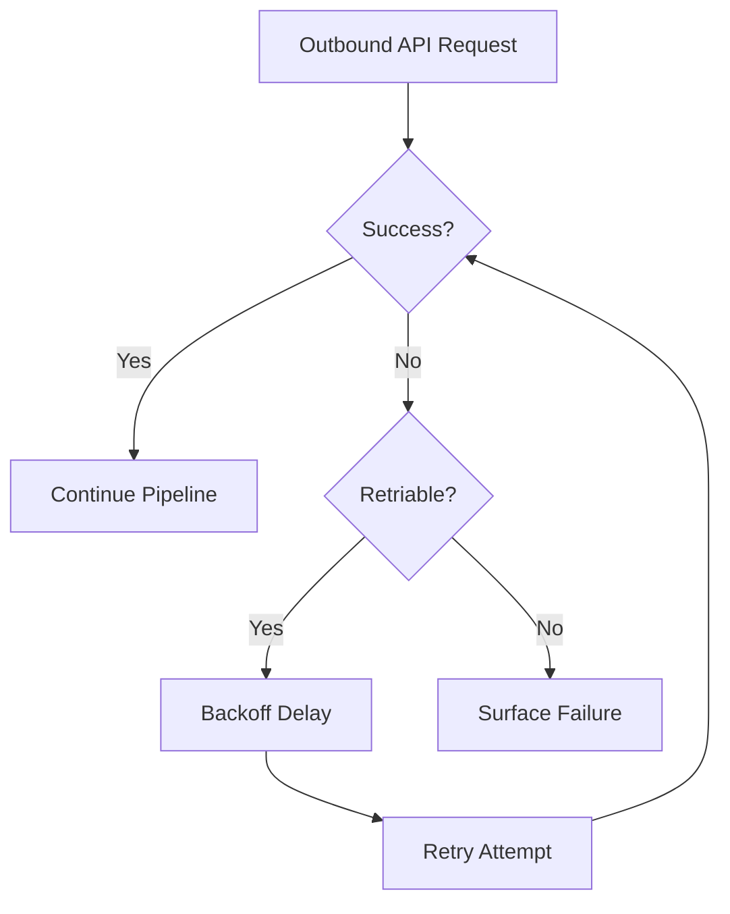

# Reliability Engineering

## Reliability Objective

The migration platform is built to maintain correctness and progress under external API instability.  
Reliability controls are prioritized over peak throughput to reduce migration failure risk.

## External APIs as Unreliable Dependencies

Source and sink APIs are treated as volatile dependencies because they can exhibit:

- transient rate limiting (`429`),
- temporary platform failures (`5xx`),
- network latency spikes and timeouts,
- partial success responses in batch operations.

The platform assumes these conditions are normal in production migration windows.

## Retry Strategy

Both API clients use retry-enabled HTTP sessions.

| Client | Retry Scope | Target Conditions |
|---|---|---|
| Mailchimp client | extraction requests | 429, 500, 502, 503, 504 |
| HubSpot client | batch upsert requests | 429, 500, 502, 503, 504 |

Backoff controls pacing between retry attempts to reduce repeated pressure on degraded dependencies.

## Transient Failure Handling

### 429 Handling

- Treated as temporary throttling rather than terminal failure.
- Retry + backoff allows the platform to recover when rate budget returns.

### 5xx Handling

- Treated as temporary upstream service instability.
- Retried within configured envelopes before surfacing failure.

### Timeout Handling

- Requests are issued with explicit timeout values.
- Timeouts trigger retry behavior when classified as recoverable transport failures.

## Session Reuse

Persistent HTTP sessions are reused for both source and sink clients:

- avoids repeated connection setup overhead,
- improves request efficiency in long-running loops,
- provides a consistent retry adapter surface for all requests.

## Partial Batch Failure Behavior

HubSpot batch responses may contain partial failures.

- The client surfaces partial errors in logs.
- Successful subset processing remains preserved.
- Operational teams can triage and replay failed records as needed.

This avoids all-or-nothing assumptions that are unsafe for real batch APIs.

## Reliability Control Envelope

## Operational Resilience Model

Reliability is composed across layers:

1. **Transport resilience** with retries/backoff.
2. **Execution resilience** with checkpoint-based restart.
3. **Write resilience** with idempotent upsert semantics.
4. **Operational resilience** with runtime logs and deterministic control flow.

## Why Retry Envelopes Improve Migration Safety

- Convert many transient failures into successful continuation.
- Prevent unnecessary operator intervention for temporary API events.
- Preserve migration momentum during long-run instability windows.

## Why Resilience Was Prioritized Over Raw Throughput

For CRM migration cutovers, failure recovery and correctness are higher-value than maximizing records/sec:

- reruns are expensive and risky,
- duplicates/omissions are business-critical defects,
- predictable restart paths reduce operational exposure.

