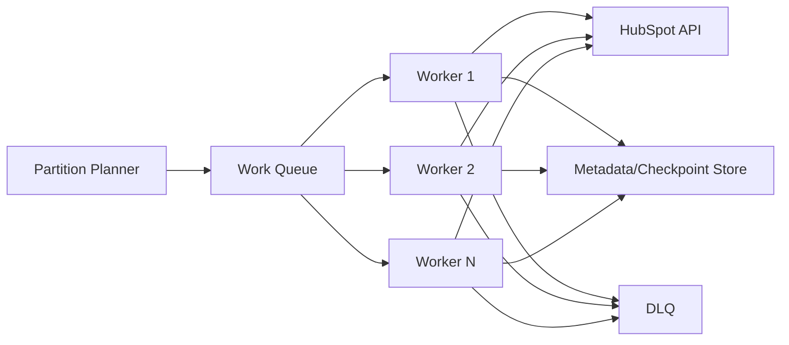

# Scalability Documentation

## Current Scalability Behavior

The current platform scales through **bounded batch iteration** rather than concurrency.  
It supports larger datasets by keeping memory and API pressure controlled at each loop boundary.

## Batching Strategy

- Sink writes are grouped into HubSpot batch upsert calls.
- Batch size is controlled by source page size and transformed output.
- Batching reduces write amplification and improves API call efficiency.

## Pagination Strategy

- Source extraction uses offset + limit pagination.
- Page limits are bounded to API-safe sizes.
- Migration progression is deterministic through incremented offsets.

## Memory Considerations

- Processing is page-scoped: only current batch records are held in memory.
- Memory footprint remains proportional to page size, not total audience size.

## Throughput Considerations

- Throughput is primarily constrained by source/sink API latency and rate policy.
- Session reuse reduces connection overhead.
- Retry envelopes trade peak speed for run completion reliability.

## Retry Scalability

Retry behavior scales safely under transient failure rates but impacts wall-clock duration:

| Condition | Effect |
|---|---|
| Healthy API window | Near-baseline batch throughput |
| Rate-limit pressure | Increased backoff delays |
| Intermittent 5xx | Elevated retry attempt count |
| Sustained instability | Longer completion times, preserved safety |

## Current Bottlenecks

1. Single-process synchronous execution.
2. File-based checkpoint state (non-distributed).
3. No queue decoupling between extraction and loading.
4. Partial failure records not yet routed to durable replay channel.

## Future Distributed-Worker Architecture

## Async Processing Roadmap

- Replace synchronous request loop with async I/O workers.
- Add bounded concurrency controls per API endpoint and quota profile.
- Keep idempotent sink semantics and centralized checkpoint coordination.

## Queue-Based Migration Evolution

Planned queue decoupling model:

1. Extractor publishes normalized records/tasks.
2. Loader workers consume and upsert with controlled parallelism.
3. Acknowledgment updates distributed progress metadata.

Benefits:

- independent scaling of extract/load stages,
- improved burst handling,
- easier backpressure management.

## DLQ Evolution

Introduce a Dead Letter Queue for non-retriable or repeatedly failing records:

- isolate poison records,
- preserve high completion ratio for healthy data,
- support targeted replay and remediation workflows.

## Metadata Store Evolution

Move from file-based state to centralized metadata:

- run-level metadata (status, counters, timings),
- partition-level checkpoint state,
- retry and error diagnostics,
- reconciliation outputs.

This transition enables distributed execution and stronger operational governance.

